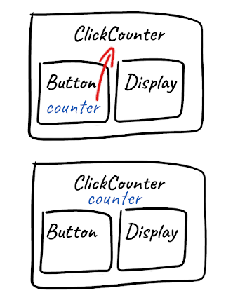

 on [Unsplash](https://unsplash.com/s/photos/lifting?utm_source=unsplash&utm_medium=referral&utm_content=creditCopyText)")

In this post I describe lifting up the state in React basing on a simple example.

## Scenario of lifting up the state

Typically, when creating components, we make them stateful because we need to hold some data which is necessary for the component to render. Let's use an example of a `ButtonDisplayingClicks` component that shows how many times the button was clicked:

```jsx
class ButtonDisplayingClicks extends React.Component {
  constructor(props) {
    super(props);
    this.state = {
      counter: 0,
    };
  }

  handleClick = () => {
    this.setState(prevState => ({
      counter: prevState.counter + 1,
    }));
  };

  render() {
    return (
      <button onClick={this.handleClick}>
        Clicked {this.state.counter} times
      </button>
    );
  }
}

ReactDOM.render(<ButtonDisplayingClicks />, document.getElementById("root"));
```

We hold the information about clicks in the `counter` state property and display the value in the message inside the button.

Now let's imagine that we want to refactor the `ButtonDisplayingClicks` component and have the button and display message as a two standalone separate components. As a first step we could create new `Button` and `Display` components and simply divide the existing code between them. Then we could use these components inside the new parent `ClickCounter` component, which could look like this:

```jsx
function ClickCounter(props) {
  return (
    <>
      <Button />
      <Display />
    </>
  );
}

class Button extends React.Component {
  constructor(props) {
    super(props);
    this.state = {
      counter: 0,
    };
  }

  handleClick = () => {
    this.setState(prevState => ({
      counter: prevState.counter + 1,
    }));
  };

  render() {
    return <button onClick={this.handleClick}>Click me</button>;
  }
}

function Display(props) {
  return <p>Clicked {counter} times</p>;
}

ReactDOM.render(<ClickCounter />, document.getElementById("root"));
```

But this code will not work, because the `Display` button does not have access to the `counter` property of the `Button` component's state. As I mentioned in this [React state basics](/state) post, the state is private to the component that holds it and cannot be accessed or modified from outside. So now we have a situation in which there are two separate components that depends on the same state - a `Display` that needs to show the `counter`, and `Button` that needs to update it upon being clicked. To solve the problem, we can _lift up the state_. The idea is to move the state that needs to be accessed by two or more components up to their closest common ancestor. Then we can use props for passing the state property values and update handler methods to children components.

Since in our example the closest ancestor of both `Button` and `Display` components is the `ClickCounter` component, we need to lift (move) the state with the `counter` property up to this component. The sketch below visualizes this:



Here is how the final code looks like:

```jsx
class ClickCounter extends React.Component {
  constructor(props) {
    super(props);
    this.state = {
      counter: 0,
    };
  }

  incrementCounter = () => {
    this.setState(prevState => ({
      counter: prevState.counter + 1,
    }));
  };

  render() {
    return (
      <>
        <Button onClick={this.incrementCounter} />
        <Display message={`Clicked ${this.state.counter} times`} />
      </>
    );
  }
}

function Button(props) {
  return <button onClick={props.onClick}>Click me</button>;
}

function Display(props) {
  return <p>{props.message}</p>;
}
```

The state is lifted up to the `ClickCounter` component and we pass down the `counter` property value down to the `Display` component within the `message` prop.
Since the component's state can only be updated from within this component, the `ClickCounter` component also contains the method for updating the state which was previously inside the `Button` component (it is renamed to `incrementCounter` since this name is more appropriate from the parent's point of view). Since now the `Button` component does not have any methods, we can simplify it an make it a function component (instead of class component). The last important part is updating the state when the button is clicked. A component cannot modify its parent state directly, therefore we pass the `incrementCounter` handler method within the `onClick` prop, and invoke it when button's `onClick` event is fired, updating state as a result.

## Summary

The important message is that state can be lifted up when there are two or more separate components depending on it. We should lift only the parts of the state that are relevant. Then we can pass the state down to the children through props. To update the state, we need to additionally pass down the parents' handler methods through props, and invoke them when appropriate event happens.
