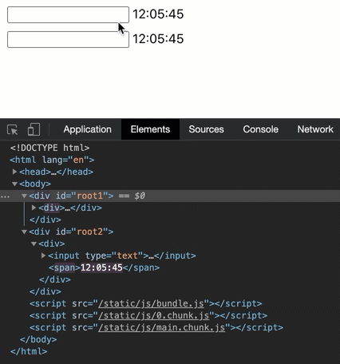

In this short post I will describe what I learned recently about rendering elements in React.

## How to render in React

Rendering in React is done using a `ReactDOM.render()` method:

```javascript
ReactDOM.render(element, container[, callback])
```

The first argument is an element that we want to be rendered. Second argument is the DOM node in which we want it to be rendered. A third optional argument is a callback function that will get executed when the element is rendered or updated.

Let's see an example:

```javascript
ReactDOM.render(<h1>Greetings</h1>, document.getElementById(`root`), () =>
  console.log("Rendered or updated")
);
```

This will render `<h1>Greetings</h1>` element within the `root` DOM node and log `Rendered or updated` to the console when the rendering is done.

Calling `ReactDOM.render()` method tells React that we want it to manage the rendering in given DOM node. Typically in React there is one `root` node in which we render all UI.

## Updating

Updating of the rendered content is where the magic starts. When the `ReactDOM.render()` is called for the first time, any DOM elements that were within the container node will be removed. But when we call this method again for this container, the elements will **not** be removed. Instead, React will perform a diffing operation to check what exactly changed, and will update only these specific parts od DOM. To show the implications of such behaviour, let's compare it with updating via standard Web API:

```javascript
const display = () => {
  document.getElementById("root1").innerHTML = `<div>
      <input type="text"/>
      <span>${new Date().toLocaleTimeString()}</span>
    </div>`;

  ReactDOM.render(
    <div>
      <input type="text" />
      <span>{new Date().toLocaleTimeString()}</span>
    </div>,
    document.getElementById(`root2`)
  );
};

setInterval(display, 1000);
```

Here the `display()` function will do render the same elements using two different approaches. It will firstly use standard Web API `innerHTML` method to add a `div` containing `input` and a `span` with the current time value. This will be rendered within `root1` container. Then in `root2` container, it will render the same elements, but using `ReactDOM.render()`. Lastly, to update the view we are setting an interval that will invoke the `display()` method every second. The animation below shows the rendered result:



This example demonstrates the React magic. As we can see, the first input gets re-rendered every second. The downside for user is that the text entered to input is also lost when the element gets re-rendered. We can also see in the dev-tools that the whole `div` node is being completely replaced every second.

The second input however retains the entered text. In dev-tools we can see that actually only the `span` value with the time is being re-rendered. This is because React is updating only what changed, and rest of the elements are not affected.

## Conclusion

React way of rendering elements is very convenient. We can simply focus on declaring what we want to see on the UI, and React will take care of the updating part for us.
